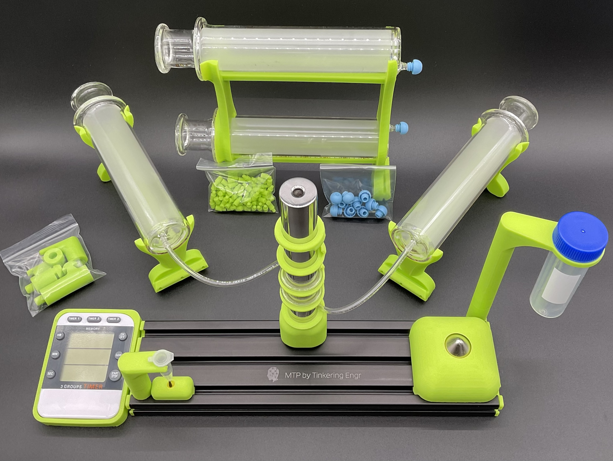

# Magnetic Trap Purification

Magnetic Trap Purification (MTP) is a novel method/apparatus on a tried and true purification technology (magnetic resins). By replacing antiquated magnetic stands with a magnetic construction that reaches >12,000 surface gauss, magnetic particles from an arbitrary volume can be flowed around a magnet trap. Enabling researchers to achieve a clean purification in a fraction of the time. The platform is open-source (protocols and hardware) ensuring modifications and improvements will continue to be avalable to researchers for the duration of their lab.  A platform to build on. 

  

  

Protocol Walkthrough: https://www.youtube.com/watch?v=efe5PQnb2tk
  
Order: https://tinyurl.com/vvvw4u3x

